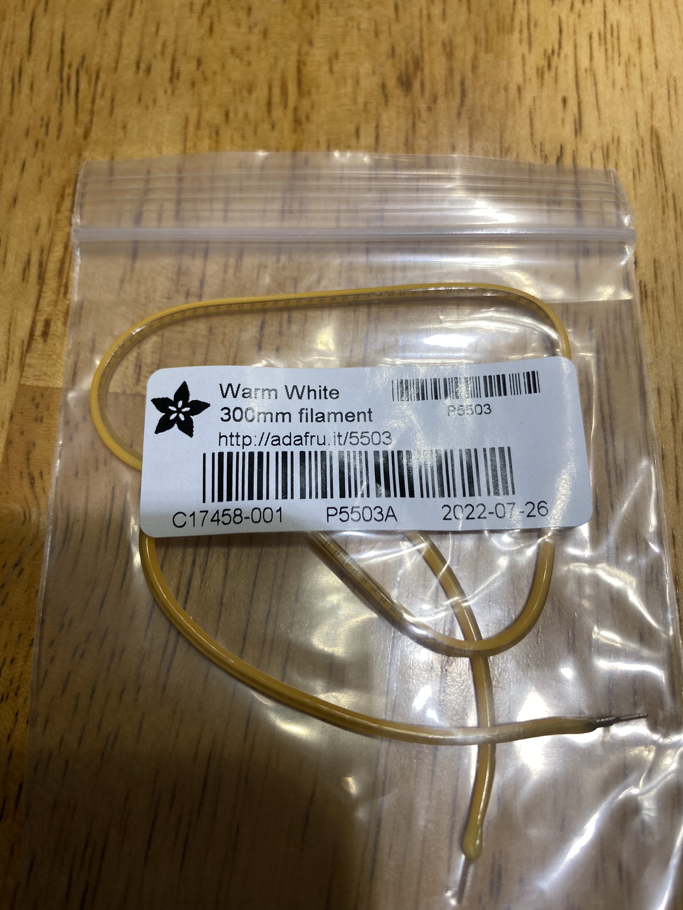

# ElectronicProjects-Electronics Project Using Filament LEDs

## Supply List
* Hot glue gun
* Wood Dowl rod to elevate the sign over the rose covered backdrop
* Acrylic paint, can use latex house paint as well
* Shrink wrap-clear would be better but black will work
* Wire-something fairly flexible, in the project I used recycled CAT 5 wire
* Decorative wording, in this case the wording was made of cardboard purchased at Hobby Lobby. 
* Led Filaments-In the project the filament LEDs were purchased from Adafruit (11.7 inches in length) Number depends on the project
* Soldering Iron-If you don't have experience soldering I would suggest a watching videos, here one I like but there are many others available on youtube:
 https://www.youtube.com/watch?v=QKbJxytERvg

## Product info-LED filament: ooohttps://youtu.be/FzVV738YoCw

## STEP 1: Creating a back drop for the filament lighting

## STEP 2: Paint the decorative words(sign) that will be backlit

## STEP 3: Wire the LEDS to the back of the sign

Finished product

https://www.youtube.com/watch?v=04Mv16TsON4
